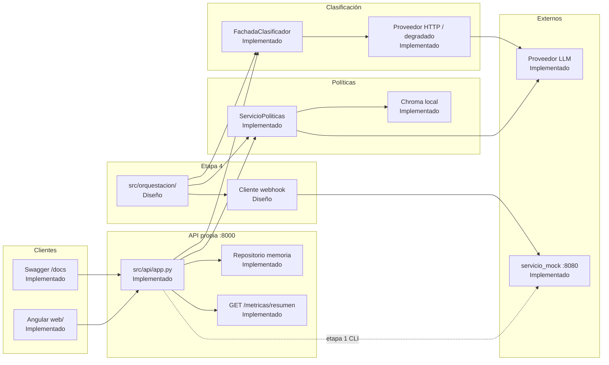

# Arquitectura — Mesa de Ayuda Inteligente

**Etapa 4 · Ingeniero IA Middle I**  
**Alcance en tres días:** este documento y los ADR son el núcleo evaluable.
La demo de orquestación y el cliente webhook pueden ser parciales; lo que
aún no corre en código está etiquetado como **diseño**.

| Etiqueta | Significado |
|---|---|
| **Implementado** | Existe en el repo y se puede ejercer hoy |
| **Diseño** | Decidido y documentado; código pendiente o parcial |

---

## 1. Componentes



### Inventario (cada caja cita módulo o ruta)

| Componente | Ruta / módulo | Estado |
|---|---|---|
| API REST | `src/api/` — `POST/GET /solicitudes`, `POST /politicas/consultar`, `GET /health`, `GET /metricas/resumen` | Implementado |
| Persistencia demo | `src/api/repositorio.py` (memoria) | Implementado |
| Clasificador | `src/ia/fachada.py`, `src/ia/proveedor_http.py`, `src/ia/degradado.py` | Implementado |
| RAG | `src/rag/servicio.py`, `retriever.py`, `vector_store.py` | Implementado |
| Config / secretos | `src/configuracion.py`, `.env.example` | Implementado |
| Logs | `src/observabilidad.py` (JSON + `X-Request-ID`) | Implementado |
| Métricas | `src/metricas.py` | Implementado |
| Angular | `web/` | Implementado (opcional) |
| Mock externo | `materiales/servicio_mock/` (no se modifica) | Implementado (consumo GET/POST etapa 1) |
| Orquestador | `src/orquestacion/` | **Diseño** (paquete reservado; ADR 1) |
| Webhook bidireccional | cliente sobre `POST /webhook/mensajeria` | **Diseño** (ADR 2) |
| Modelo relacional objetivo | tablas en §4 y ADR 3 | **Diseño** (demo sigue en memoria) |

---

## 2. Flujo extremo a extremo

### 2.1 Camino feliz (con evidencia en políticas)

1. El colaborador o la integración llama `POST /solicitudes` con Bearer
   (`API_TOKEN`). **Implementado.**
2. La API valida el cuerpo; si hay `Idempotency-Key` repetida con el mismo
   cuerpo, reusa el registro **sin** volver a llamar al LLM. **Implementado.**
3. `FachadaClasificador` asigna categoría y prioridad (o degrada a
   `Sin clasificar` / `Media`). El ticket se crea en **201** aunque falle el
   proveedor. **Implementado.**
4. El orquestador (**Diseño**) toma la solicitud y, si hace falta una
   respuesta normativa, llama a `ServicioPoliticas.consultar_politica` (o
   `POST /politicas/consultar`).
5. Si el mejor hit directo ≥ `RAG_MIN_SCORE`, el generador redacta anclado a
   citas (documento, sección, página, `fragmento_id`). **Implementado** en el
   endpoint; **Diseño** como paso del orquestador.
6. Si la confianza es alta (hay citas, no abstuvo), la respuesta se asocia al
   ticket. **Diseño** (hoy la consulta de políticas es un recurso aparte).
7. Opcional: notificar al segundo sistema vía webhook. **Diseño** (ADR 2).

### 2.2 Abstención y escalamiento

1. Misma entrada hasta el paso de consulta RAG.
2. Si no hay hits directos o el mejor score &lt; `RAG_MIN_SCORE`: mensaje fijo
   de abstención, `citas: []`, **sin** llamar al generador. **Implementado.**
3. El orquestador marca `escalado=true` y `motivo_escala` (p. ej.
   `sin_evidencia`, `score_bajo`, `clasificacion_degradada`). **Diseño.**
4. No se inventan plazos ni montos. Un agente humano toma el caso.
5. Al escalar, se puede emitir un evento idempotente al mock. **Diseño.**

### 2.3 Señales de “confianza baja” (sin inventar un score nuevo)

| Señal | Origen | Acción prevista |
|---|---|---|
| `abstuvo=true` | RAG | Escalar; no redactar |
| Score del mejor hit directo &lt; `RAG_MIN_SCORE` | Retriever | Igual que abstención |
| `origen_clasificacion=degradado` | Fachada IA | Ticket existe; revisión humana prioritaria |
| Proveedor 401/429/timeout | Clientes HTTP | Degradar / 503 en RAG; no tumbar el alta |

---

## 3. Decisiones (resumen; detalle en ADR)

| Tema | Elegido | Documento |
|---|---|---|
| Orquestador | Código propio en `src/orquestacion/` | [ADR 001](adr/001-orquestador.md) |
| Integración segundo sistema | Sincrónico + idempotencia + backoff sobre el mock | [ADR 002](adr/002-integracion-bidireccional.md) |
| Datos | Relacional para hechos + Chroma para vectores; demo en memoria | [ADR 003](adr/003-diseno-datos.md) |

---

## 4. Diseño de datos (objetivo)

### 4.1 Relacional (hechos y trazabilidad) — **Diseño**

Parte de `materiales/datos/esquema.sql` y del modelo actual de la API.

```text
solicitud
  id, asunto, descripcion, area, solicitante, canal,
  estado, fecha_creacion

clasificacion
  id_solicitud, categoria, prioridad, origen (proveedor|degradado),
  modelo, fecha

consulta_politica
  id, id_solicitud?, pregunta, abstuvo, mensaje,
  fragmento_ids (JSON), fecha

escalamiento
  id, id_solicitud, motivo, destino, fecha

evento_salida
  evento_id, id_solicitud, accion, estado (enviado|ack|agotado),
  intentos, ultima_respuesta, fecha
```

La demo **sigue en memoria**. Migrar a SQLite/MySQL no es obligatorio en
tres días; si no se hace, queda declarado aquí y en el ADR 3.

### 4.2 Vectorial (ya en producción de la demo) — **Implementado**

| Decisión | Valor | Dónde |
|---|---|---|
| Store | Chroma local, espacio **cosine** | `src/rag/vector_store.py` |
| Fragmento | Por cláusula/sección; tope ~800 tokens estimados | `src/rag/chunker.py` |
| Embeddings | Modelo OpenAI-compatible (`IA_EMBEDDING_MODEL`) | `src/rag/embeddings.py` |
| Abstención | `RAG_MIN_SCORE` (provisional 0.22) | `src/configuracion.py` |
| Compatibilidad | Sidecar hash PDF + modelo + dimensión | `indice.json` junto al índice |

**Por qué no un solo motor:** los tickets son hechos transaccionales
(idempotencia, estados, auditoría). Los fragmentos son similitud semántica
con invalidación por corpus/modelo. Mezclarlos obliga a almacenar vectores
en filas SQL o a perder transacciones ACID en el store vectorial. Detalle:
[ADR 003](adr/003-diseno-datos.md).

---

## 5. Secretos, ambientes y control de costo

### 5.1 Secretos y ambientes — **Implementado** (documentado aquí)

| Pieza | Comportamiento |
|---|---|
| `.env` | Local; en `.gitignore`; no se versiona |
| `.env.example` | Contrato sin secretos reales |
| `SecretStr` | Tokens y claves no aparecen en `repr` |
| Precedencia | Proceso / CI / Docker → `.env` → defaults |
| `APP_ENV` | `development` \| `test` \| `production` |
| Bearer | `API_TOKEN` ≠ `MOCK_TOKEN` ≠ `IA_API_KEY` |

### 5.2 Presupuesto de tokens — **Diseño** (política)

Supuestos declarados (orden de magnitud; calibrar con tarifa vigente):

| Concepto | Demo | Negocio (R-01 / políticas) |
|---|---:|---:|
| Solicitudes / día | 100 | 3.000 |
| Tokens clasificación (in+out) | ~800 | ~800 |
| Consultas RAG / día | 40 | 80 |
| Tokens embeddings + generación / consulta | ~2.000 | ~2.000 |
| Techo mensual (USD) | 50 | Definir con negocio |

**Acción al superar el techo**

1. Log estructurado `presupuesto_excedido` (sin secretos ni prompts).
2. `modo_ahorro=true`: clasificación degrada; RAG se abstiene o responde
   “servicio de IA limitado”.
3. `POST /solicitudes` **sigue en 201**. No se tumba el alta por cuota.

**Gap declarado:** `GET /metricas/resumen` acumula tokens **por instancia**
y se reinicia al apagar el proceso. Un presupuesto mensual real requiere
persistir el contador (tabla o almacén externo; ADR 3). Mientras tanto la
política es válida como diseño y la demo mide consumo de la corrida.

---

## 6. Fallos anticipados (arquitectura)

| Fallo | Control |
|---|---|
| Evaluador cree que orquestación/webhook ya corren | Etiquetas Implementado / Diseño en este doc y en el README |
| Orquestador llama OpenAI directo | Prohibido: solo `FachadaClasificador` y `ServicioPoliticas` |
| RAG inventa plazos sin evidencia | Abstención sin generador; escalar |
| Mock modificado para “hacer pasar” la integración | Prohibido; control solo en nuestro cliente (ADR 2) |
| Reinicio borra tickets e idempotencia | Aceptado en demo; modelo relacional objetivo en ADR 3 |
| Cuota LLM tumba el servicio | Política de costo: degradar, no 5xx en crear |

---

## 7. Cómo leer esto en la sustentación / video

1. Abrir este archivo y seguir el Mermaid §1.
2. Narrar el camino feliz §2.1 y el de abstención §2.2.
3. Abrir los tres ADR: cada uno tiene elegido / descartado / trade-off.
4. Declarar con honestidad: etapas 1–3 implementadas; orquestación y
   webhook aún en diseño salvo lo que se cierre después en código.
